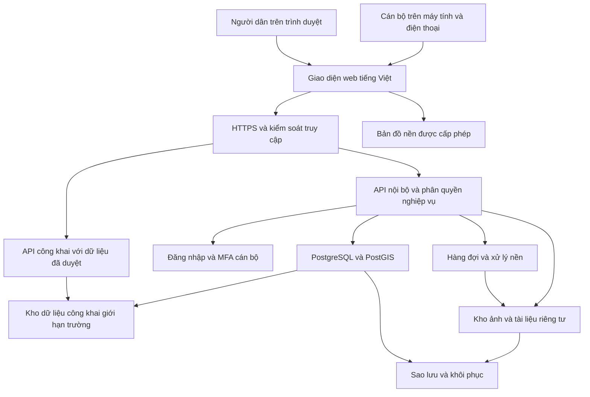

# Kế hoạch triển khai ứng dụng quản lý trật tự xây dựng phường Thảo Nguyên tỉnh Sơn La

Phiên bản 0.1 để thảo luận và phê duyệt • Ngày 13 tháng 9 năm 2026

Đề xuất xây dựng ứng dụng web lấy bản đồ làm giao diện chính, phục vụ đồng thời cán bộ và người dân theo quyền truy cập. Hạt nhân của ứng dụng là hồ sơ công trình gắn với vị trí, giấy phép, các lần kiểm tra và phản ánh. GPT-6 Astra sẽ được dùng để phát triển sau khi người dùng phê duyệt kế hoạch; việc xác nhận dữ liệu, nghiệp vụ và nghiệm thu thuộc về người phụ trách của đơn vị.

Tài liệu này là kế hoạch, chưa phải ứng dụng đã triển khai hoặc kết quả kiểm thử. Các con số về tải, thời gian và chất lượng dưới đây là mục tiêu đề xuất để chốt trong khảo sát. Kế hoạch đã cập nhật yêu cầu bắt đầu thử đầu tháng 10/2026 và ngân sách thử nghiệm 1.000.000 đồng: bản đầu giới hạn đối tượng/dữ liệu, sau đó mở rộng chức năng theo nghiệm thu.

## 1 Những nội dung đã xác nhận và giả định làm việc

Người dùng đã xác nhận:

- Cán bộ và người dân cùng xem bản đồ, nhưng được phân quyền thông tin.
- Địa bàn là phường Thảo Nguyên, tỉnh Sơn La; bắt đầu thử đầu tháng 10/2026; có thể dùng đám mây nếu được cơ quan cho phép.
- Có dữ liệu giấy phép năm 2026, bản đồ địa chính và biểu mẫu kiểm tra; sẽ cung cấp sau.
- Ngân sách thử nghiệm là 1.000.000 đồng.
- Công khai vị trí, trạng thái và một số chỉ tiêu giấy phép được duyệt; ẩn thông tin cá nhân.

Các giả định đề xuất, chưa coi là quyết định đã duyệt:

- Quản lý giấy phép đã cấp và theo dõi hiện trường; chưa bao gồm toàn bộ thủ tục tiếp nhận, thẩm định và cấp giấy phép mới.
- Google Maps là ví dụ về trải nghiệm mong muốn, chưa phải nền tảng bắt buộc.
- Người dân được xem dữ liệu đã duyệt công khai; danh tính, liên hệ, hồ sơ gốc và phản ánh chưa xác minh thuộc phạm vi hạn chế.
- Biên bản ban đầu được soạn, rà soát, xuất để ký và lưu bản đã ký. Tích hợp chữ ký số là hạng mục riêng.
- Quy mô bản thử đầu: 20–50 công trình, 2–3 cán bộ, 5–10 người dân được mời, 10 phiên hoạt động đồng thời; ảnh/tài liệu tạm giới hạn 5 GB. Bộ tải mở rộng sau này: 10.000 công trình, 50.000 bản ghi tệp, 50 phiên đồng thời. Đây là giả định thử, không phải thống kê của phường.
- Ngân sách 1 triệu đồng tạm phân bổ cho một kỳ thuê máy chủ 30 ngày, dự kiến 28/9–27/10, không coi là ngân sách được tự động lặp lại mỗi tháng. Phương án dùng tài khoản GPT-6 Astra, máy phát triển và nhân lực của người dùng/đơn vị đã có; cần xác nhận có phải chi thêm các khoản này trong trần 1 triệu không.

Các quyết định còn mở gồm số lượng cán bộ và hồ sơ, danh mục chi tiết chỉ tiêu được công khai, cơ chế xác thực phản ánh, hạ tầng được phép dùng, thành phần chi phí nằm trong trần 1 triệu, đơn vị vận hành và thời điểm cung cấp dữ liệu.

## 2 Những câu hỏi cần làm rõ

Không cần trả lời tất cả ngay. Nhóm A ảnh hưởng trực tiếp đến phạm vi và kiến trúc; nhóm B được chốt khi xem dữ liệu thật.

### Nhóm A cần chốt trước khi triển khai nghiệp vụ

1. Địa giới hiện hành của phường Thảo Nguyên lấy từ đơn vị nào? Có thể cung cấp gói mẫu đã giảm thông tin cá nhân trước 18/9 để chuẩn bị thử từ 1–7/10 không?
2. Ứng dụng chỉ theo dõi giấy phép đã cấp hay cần xử lý cả hồ sơ xin cấp phép? Có cần theo dõi công trình thuộc diện miễn giấy phép và căn cứ xác nhận không?
3. Có bao nhiêu cán bộ, bao nhiêu công trình đang thi công và bao nhiêu giấy phép năm 2026? Mỗi tháng dự kiến bao nhiêu lượt kiểm tra, phản ánh và ảnh?
4. Trong các chỉ tiêu được phép công khai, chọn cụ thể số giấy phép, chiều cao, tầng, diện tích nào? Ai duyệt danh mục và duyệt từng hồ sơ? Vị trí và trạng thái đã được người dùng chọn công khai, thông tin cá nhân được ẩn.
5. Người dân có được gửi phản ánh không tạo tài khoản hoặc không để lại danh tính? Có cần xác thực điện thoại, đăng nhập hay chỉ mã tra cứu riêng?
6. Ai tiếp nhận, phân công, kiểm tra, duyệt kết quả, duyệt ranh và đóng hồ sơ? Cán bộ được xem toàn phường hay chỉ địa bàn/công việc được giao?
7. Đám mây được phép đặt ở đâu, ai đứng tên tài khoản và tên miền, đơn vị nào vận hành? Có hệ thống đăng nhập cơ quan để kết nối không?
8. Trần 1 triệu đồng có bao gồm phí tài khoản GPT-6 Astra hay dùng tài khoản sẵn có? Có tên miền phụ và máy của đơn vị để nhận sao lưu không? Ai hỗ trợ khi ứng dụng gặp sự cố?

### Nhóm B cần chốt cùng dữ liệu mẫu

9. Cụm “địa chỉ người cấp phép” chỉ địa chỉ người được cấp phép hay địa chỉ cơ quan cấp phép? Nên tách người đề nghị, chủ đầu tư, chủ sử dụng đất, người liên hệ và cơ quan/người ký.
10. “Hệ số xây dựng” là hệ số sử dụng đất, mật độ xây dựng hay một trường khác trong mẫu? Diện tích nào dùng làm mẫu số; diện tích sàn nào được tính? Có tầng hầm, lửng, tum và các phần loại trừ không?
11. Địa chính hiện ở dạng nào: GeoPackage, Shapefile, CAD, PDF hay ảnh quét? Có số tờ, số thửa, thông số VN-2000, ngày cập nhật và quyền sử dụng không?
12. Có dữ liệu chỉ giới đường đỏ và chỉ giới xây dựng riêng không? Ai cung cấp, xác nhận và cập nhật; có bản vẽ và quyết định kèm theo không?
13. Ranh cần thể hiện ở mức phác thảo quản lý, theo bản vẽ được duyệt hay đo đạc kiểm chứng? Ai xác nhận sai số chấp nhận được?
14. Cần kiểm tra vào những giai đoạn nào? Lịch do cán bộ đặt hay chủ đầu tư báo tiến độ? Có hạn xử lý, quy tắc ngày làm việc và bước chuyển đơn vị không?
15. Biên bản dùng mẫu nào; ai ký; có cần chữ ký số ngay trong tháng 10? Hồ sơ đã ký được đính chính theo quy trình nào?
16. Cán bộ dùng Android, iPhone hay cả hai; có thiết bị dùng chung không? Mất mạng có thường xuyên, cần lưu ngoại tuyến những nội dung nào?
17. Cần báo cáo theo tuần/tháng, tổ dân phố, cán bộ, loại công trình hay loại vụ việc? Định nghĩa từng chỉ số và biểu mẫu xuất hiện có?
18. Cần kết nối hệ thống nào đang có? Có API, đầu mối và quyền truy cập chưa, hay trước mắt trao đổi bằng tệp?
19. Thời hạn lưu hồ sơ, ảnh, danh tính người phản ánh, nhật ký và bản sao lưu là bao lâu? Ai quyết định xóa, giữ lại hoặc hạn chế truy cập?
20. Khi sự cố xảy ra, chấp nhận gián đoạn tối đa bao lâu và mất tối đa bao nhiêu dữ liệu đã gửi thành công?

## 3 Mục tiêu và trải nghiệm sử dụng

Mục tiêu nghiệp vụ là biết công trình nào ở đâu, đang ở giai đoạn nào, được phép xây dựng ra sao, đã kiểm tra khi nào và còn việc gì phải xử lý. Mọi chỉ tiêu đều truy lại được tài liệu và phiên bản liên quan.

Mục tiêu trải nghiệm:

- Người dân gửi phản ánh trong ba bước: chọn vị trí → mô tả và ảnh → kiểm tra, gửi và nhận mã tra cứu.
- Cán bộ từ bản đồ mở hồ sơ, đối chiếu giấy phép, thêm lần kiểm tra và tạo dự thảo biên bản trong cùng một luồng.
- Lãnh đạo xem công việc chưa xử lý, quá hạn, lịch kiểm tra và tình hình địa bàn.
- Người chưa quen bản đồ vẫn dùng được tìm kiếm địa chỉ, danh sách công trình và biểu mẫu nhập vị trí.

Các mục tiêu đo trong thử nghiệm: ít nhất 90% nhiệm vụ cốt lõi hoàn thành không cần người hướng dẫn; tra được hồ sơ mẫu trong 30 giây; gửi phản ánh mẫu có sẵn nội dung trong 3 phút, không tính thời gian chờ tải ảnh do mạng. Thử với 5–8 cán bộ và 5–8 người dân nếu quy mô cho phép; báo cáo tỷ lệ riêng theo nhóm và nhiệm vụ.

Giao diện hoàn toàn bằng tiếng Việt, nhãn rõ như “Lấy vị trí”, “Lưu nháp”, “Gửi phản ánh”, “Lập phiếu kiểm tra”. Đề xuất chữ nội dung từ 16 px và vùng bấm chính khoảng 44 × 44 px; trạng thái có chữ và biểu tượng bên cạnh màu. Bố cục điện thoại ưu tiên một tay; bản đồ toàn màn hình và bảng thông tin kéo mở. Máy tính dùng bản đồ, danh sách lọc và bảng hồ sơ cạnh nhau.

Đặt mục tiêu WCAG 2.2 AA cho các luồng trọng yếu, có hỗ trợ bàn phím, nhãn cho trình đọc màn hình, phóng to và cách thay thế thao tác kéo thả. Đây là mục tiêu phải kiểm tra, chưa phải tuyên bố đạt chuẩn. [Tiêu chuẩn WCAG 2.2 của W3C](https://www.w3.org/TR/WCAG22/).

## 4 Phạm vi chức năng và mức ưu tiên

Mốc A là bản thử giới hạn ngày 1–7/10; mốc B là hoàn thiện dần trong kỳ thử sau khi đạt kiểm tra; mốc C là nâng cấp sau thí điểm. Các mô tả nghiệp vụ đầy đủ ở mục 5–11 là thiết kế đích; phạm vi A được giới hạn cụ thể dưới đây để phù hợp thời gian và ngân sách. Dữ liệu thật và mẫu thật chỉ dùng khi đã nhận và được kiểm tra.

| Mốc A từ 1–7/10 | Mốc B trong kỳ thử | Mốc C sau thí điểm |
|---|---|---|
| Đăng nhập cán bộ, quyền theo vai trò; bản đồ công khai chỉ có trường đã duyệt | Bổ sung phạm vi công việc/địa bàn chi tiết khi có nhu cầu | Kết nối đăng nhập và hệ thống cơ quan |
| 20–50 hồ sơ, đủ ô thông tin chính theo giấy phép; nhập tay hoặc lô CSV do kỹ thuật kiểm tra | Giao diện nhập có xem trước và xử lý lỗi | Nhập hàng loạt nhiều định dạng, OCR |
| Điểm công trình, nhập ranh nguồn đã chuẩn hóa, vẽ polygon phác thảo đơn giản có phiên bản | Sửa đỉnh nâng cao, đối chiếu nhiều lớp/phiên bản | Kết nối dịch vụ GIS và cập nhật nguồn tự động |
| Phản ánh vị trí, mô tả, ảnh, mã tra cứu; mới nhận → kiểm tra → có kết quả | Bổ sung phân công, yêu cầu bổ sung, gộp trùng, mở lại | Nhắc qua SMS/Zalo hoặc kênh tích hợp được duyệt |
| Phiếu kiểm tra đơn giản, ảnh, ghi nhận chỉ tiêu, lưu nháp trên máy chủ | Biên bản theo mẫu đơn vị, rà soát, xuất PDF, lưu bản đã ký | Chữ ký số và quy trình liên thông |
| Phiếu ghi nhận để in có nhãn thử nghiệm; chỉ dùng mẫu chính thức nếu đã được đơn vị duyệt và kiểm thử | Công việc, tái kiểm tra, thống kê đã chốt | Báo cáo nâng cao, phân tích xu hướng |
| Nhật ký, chống gửi trùng, kiểm thử quyền/GIS/tệp, sao lưu và thử phục hồi | Cải thiện thiết bị/mạng dựa trên kết quả thử | Ngoại tuyến có lưu ảnh; bản đồ ngoại tuyến theo nhu cầu |

Mốc A làm việc trực tuyến, có hiển thị đang gửi/thất bại và gửi lại an toàn; chưa cam kết lưu ảnh ngoại tuyến khi đóng trình duyệt. Bản thử không thay thế hệ thống hồ sơ chính thức hoặc quy trình ký của đơn vị. Không giảm kiểm tra phân quyền, độ toàn vẹn hồ sơ và khôi phục để chạy kịp ngày.

| Mã | Hạng mục của phiên bản nghiệp vụ đầy đủ | Kết quả người dùng nhận được |
|---|---|---|
| F01 | Tài khoản cán bộ và phân quyền | Mỗi người thấy và thực hiện đúng nhiệm vụ |
| F02 | Bản đồ, tìm kiếm và danh sách | Tìm theo địa chỉ, số giấy phép, công trình; lọc giai đoạn, địa bàn, lịch kiểm tra |
| F03 | Hồ sơ giấy phép và lịch sử | Nhập, sửa bản nháp, duyệt; quản lý điều chỉnh, gia hạn, tài liệu kèm theo |
| F04 | Vị trí và hình học công trình | Điểm, đường, vùng; nhập dữ liệu nguồn; vẽ/sửa phác thảo; lưu phiên bản và người duyệt |
| F05 | Bản đồ công khai | Chỉ cung cấp trường và đối tượng được phép công khai |
| F06 | Phản ánh | Chọn vị trí, mô tả, ảnh, gửi, mã tra cứu; tiếp nhận, phân công, xác minh, phản hồi |
| F07 | Kiểm tra hiện trường | Lịch, giai đoạn, số đo, ảnh, ghi nhận và đối chiếu chỉ tiêu |
| F08 | Biên bản và tệp đã ký | Tạo dự thảo theo mẫu, rà soát, xuất PDF, lưu bản đã ký và lịch sử |
| F09 | Công việc và thống kê | Việc của tôi, quá hạn, tái kiểm tra; báo cáo tổng hợp và xuất dữ liệu theo quyền |
| F10 | Nhật ký và vận hành | Dấu vết thay đổi, sao lưu, khôi phục, giám sát và hướng dẫn sử dụng |
| F11 | Chống mất dữ liệu khi mạng chập chờn | Gửi lại an toàn; bản nháp giới hạn trên thiết bị cán bộ đã kiểm chứng |
| F12 | Nhập dữ liệu có kiểm tra | Xem trước, báo lỗi từng dòng, xử lý trùng và đối soát sau nhập |

Chức năng nên bổ sung sau khi thí điểm ổn định: QR của hồ sơ công trình, nhắc lịch qua kênh được cơ quan duyệt, quản lý yêu cầu khắc phục và tái kiểm tra sâu hơn, đối chiếu ảnh theo thời gian, kết nối phần mềm hiện có, OCR hỗ trợ nhập giấy phép, chữ ký số, và gói bản đồ ngoại tuyến khi đủ điều kiện.

OCR hoặc AI chỉ đề xuất dữ liệu/nhận xét để cán bộ xác nhận. Không dùng ảnh điện thoại để tự suy ra chắc chắn chiều cao, ranh pháp lý hoặc tự kết luận vi phạm. 3D, drone, nhận dạng vi phạm tự động và triển khai đa phường không nằm trong mục tiêu tháng 10.

## 5 Hồ sơ và quy trình nghiệp vụ

### Hồ sơ công trình và giấy phép

Một công trình có hồ sơ trung tâm với mã ổn định, địa chỉ, thửa liên quan, vị trí, giai đoạn và người phụ trách. Một công trình có thể liên quan nhiều thửa, nhiều giấy phép, nhiều lần điều chỉnh, nhiều phản ánh và nhiều cuộc kiểm tra.

Giấy phép: nhập nháp → kiểm tra → xác nhận đưa vào quản lý. Điều chỉnh/gia hạn/thay thế tạo bản ghi hoặc phiên bản liên kết tài liệu nguồn. Không ghi đè nội dung cũ đã được xác nhận. Ngày hiệu lực và ngày nhập hệ thống được lưu riêng.

Tiến độ công trình: chưa khởi công → đang thi công → tạm dừng → hoàn thành, có lịch sử chuyển trạng thái. Tiến độ độc lập với tình trạng giấy phép và hồ sơ xử lý. “Chưa có dữ liệu giấy phép” và “thuộc diện miễn giấy phép đã xác nhận” là hai tình trạng khác nhau; thiếu giấy phép trong cơ sở dữ liệu không tự đồng nghĩa xây dựng trái phép.

### Phản ánh của người dân hoặc cán bộ

Người gửi có thể chọn một công trình hoặc chỉ chọn một điểm chưa gắn hồ sơ. Địa chỉ gợi ý phải được người gửi xác nhận. Nội dung gồm mô tả, ảnh, loại vấn đề và thông tin liên hệ nếu cơ chế tiếp nhận yêu cầu.

Quy trình: mới gửi → sàng lọc → phân công → đang xác minh → có kết quả → đóng. Các nhánh bổ sung gồm cần thêm thông tin, trùng phản ánh, ngoài địa bàn/chuyển đơn vị, không đủ cơ sở và mở lại. Mọi chuyển trạng thái lưu người thực hiện, thời điểm và lý do. Hạn xử lý cấu hình theo quy trình được duyệt, không tự đặt thành thời hạn pháp luật.

Đề xuất giảm rào cản: người dân xem bản đồ không cần đăng nhập; phản ánh thông thường có thể không cần tài khoản nếu cơ quan đồng ý. Cấp mã hồ sơ và mã tra cứu bí mật ngẫu nhiên; tra cứu chỉ trả thông tin tối thiểu của phản ánh đó, không trả hồ sơ cán bộ hay liên hệ người khác. Mã bí mật không nằm trong URL hoặc nhật ký thông thường. Nếu cần trao đổi thông tin nhạy cảm, yêu cầu xác thực bổ sung. Chống gửi rác bằng giới hạn tần suất, hạn mức tệp, bẫy bot và thử thách khi có dấu hiệu lạm dụng.

Phản ánh chưa xác minh không tự xuất hiện trên bản đồ công khai. Gợi ý trùng theo khoảng cách và thời gian chỉ hỗ trợ người tiếp nhận; gộp phải giữ các phản ánh nguồn và lịch sử phản hồi.

### Kiểm tra hiện trường và biên bản

Quy trình: lên lịch → giao cán bộ → ghi nhận hiện trường → hoàn thiện → rà soát/duyệt → kết thúc. Giai đoạn như móng, kết cấu, hoàn thiện chỉ là danh mục ban đầu để đơn vị điều chỉnh.

Phiếu kiểm tra chụp lại phiên bản giấy phép và ranh áp dụng tại thời điểm kiểm tra. Bảng đối chiếu gồm chỉ tiêu được phép, giá trị ghi nhận, đơn vị, phương pháp/thiết bị đo, người ghi nhận, chênh lệch và nhận xét. Giá trị chưa đo phải là “chưa xác định”, không thay bằng 0.

Ảnh lưu bản gốc tiếp nhận, bản xem nhanh riêng và bản đánh dấu nếu có. Lưu thời gian chụp do thiết bị cung cấp khi có, thời gian máy chủ nhận, nguồn ảnh, tọa độ, độ chính xác thiết bị và người gửi. Mã kiểm tra toàn vẹn giúp phát hiện tệp bị thay đổi; không tự chứng minh tính xác thực của cảnh chụp.

Biên bản: nháp → rà soát → chốt nội dung → lưu bản đã ký. Mỗi bản xuất gắn phiên bản mẫu, dữ liệu chụp tại thời điểm lập, người lập và các tệp liên quan. Bản đã chốt hoặc đã ký không sửa trực tiếp; đính chính tạo phiên bản mới có lý do. Bản PDF được ứng dụng tạo là dự thảo cho tới khi hoàn tất quy trình ký được đơn vị chấp nhận.

Nếu xác minh thấy cần xử lý, mở hồ sơ theo dõi gồm căn cứ, kết luận của người có thẩm quyền, yêu cầu khắc phục, thời hạn, tài liệu quyết định và tái kiểm tra. Ứng dụng theo dõi quy trình đã được xác nhận, không tự phát hành quyết định xử phạt.

## 6 Lựa chọn bản đồ và độ tin cậy không gian

Khuyến nghị mặc định là MapLibre GL JS + Terra Draw + PostGIS. MapLibre hiển thị bản đồ, Terra Draw hỗ trợ tương tác vẽ, còn PostGIS lưu và xử lý hình học phía máy chủ. Trong ngân sách thử, dùng gói nền đường phố OSM/Protomaps cho một vùng nhỏ quanh phường, tự phục vụ trên cùng máy chủ, không gọi API bản đồ trả phí. Kiểm chứng độ đầy đủ tên đường, mức zoom, quyền nguồn, ghi công và dung lượng trước khi chốt. Nền này không mặc nhiên có ảnh vệ tinh. [Tài liệu MapLibre](https://maplibre.org/maplibre-gl-js/docs/).

| Tiêu chí | Google Maps JavaScript API | MapLibre với nguồn nền phù hợp |
|---|---|---|
| Trải nghiệm | Quen thuộc, có hệ sinh thái bản đồ/tìm kiếm | Thiết kế trải nghiệm tương tự; phải chọn dịch vụ nền và tìm kiếm |
| Vẽ ranh | Cần công cụ thay thế Drawing Library cũ | Tích hợp công cụ vẽ độc lập |
| Dữ liệu quản lý | Lớp nghiệp vụ do ứng dụng quản lý | Lớp nghiệp vụ do ứng dụng quản lý |
| Quyền số hóa và ngoại tuyến | Có giới hạn hợp đồng cần đối chiếu | Phụ thuộc giấy phép nguồn nền, không tự được miễn giới hạn |
| Chi phí | Theo các dịch vụ sử dụng | Thư viện mở, nhưng nền, lưu trữ và vận hành vẫn có phí |

Google xác nhận Drawing Library đã không còn khả dụng từ tháng 5/2026. Điều khoản Google mục 3.2.3(c) cũng hạn chế tạo dữ liệu từ nội dung Google, bao gồm đồ/số hóa đường bao công trình từ nền vệ tinh Maps JavaScript API. Do đó cần phân biệt hiển thị ranh do cơ quan cung cấp với số hóa ranh dựa trên ảnh Google. [Tình trạng Drawing Library](https://developers.google.com/maps/deprecations), [điều khoản Google Maps Platform](https://cloud.google.com/maps-platform/terms).

Không lấy máy chủ tile OpenStreetMap công cộng làm nền có cam kết vận hành hoặc tải trước toàn phường; dùng nhà cung cấp thích hợp hoặc dữ liệu tự phục vụ với giấy phép phù hợp. [Chính sách tile OpenStreetMap](https://operations.osmfoundation.org/policies/tiles/).

Đối với kỳ thử Thảo Nguyên, cắt gói PMTiles từ nền Protomaps theo phạm vi do đơn vị xác nhận, tự phục vụ cả nền, kiểu hiển thị, chữ và biểu tượng. Không nhập hồ sơ riêng tư vào gói nền công khai. Nền là dữ liệu OSM theo điều kiện cấp phép, phải ghi nguồn; khả năng phóng lớn của giao diện không tạo thêm chi tiết nền. Kiểm tra tên đường/ngõ và ngày dữ liệu trước khi dùng. Gói PMTiles đọc bằng HTTP Range; thử đầy đủ nhãn tiếng Việt và khả năng tải khi không gọi dịch vụ bản đồ bên ngoài. Nếu không đạt sau 1–2 ngày kiểm chứng, dùng nền GeoJSON đường/địa danh đơn giản từ nguồn OSM được phép. [Nguồn nền Protomaps](https://docs.protomaps.com/basemaps/downloads), [công cụ cắt và kiểm tra PMTiles](https://docs.protomaps.com/pmtiles/cli), [thành phần nền MapLibre](https://docs.protomaps.com/basemaps/maplibre).

Các lớp cần tách: địa giới phường; thửa đất; khu đất liên quan giấy phép; hình chiếu/phạm vi được xây dựng theo hồ sơ; hiện trạng; chỉ giới đường đỏ; chỉ giới xây dựng; điểm phản ánh; vị trí kiểm tra. Lớp nào chưa có nguồn thì hiển thị “chưa có dữ liệu”. Không suy diễn chỉ giới đường đỏ từ mép đường nhìn thấy trên bản đồ nền.

Mỗi hình học có nguồn, ngày lập/hiệu lực, tỷ lệ hoặc độ chính xác khi biết, người nhập/duyệt, tài liệu kèm theo và phiên bản. Nhãn chất lượng: theo hồ sơ được duyệt; đã đo kiểm; phác thảo tham khảo. Công cụ vẽ có điểm/đường/vùng, sửa đỉnh, hoàn tác và nhập tọa độ; không bắt người dân vẽ vùng.

Đối với địa chính VN-2000, phải xác định kinh tuyến trục, múi chiếu, đơn vị và tham số chuyển đổi từ chủ dữ liệu. Giữ nguyên nguồn và chỉ một bản hình học chuẩn làm nguồn chỉnh sửa; bản WGS84/GeoJSON dùng hiển thị là sản phẩm dẫn xuất. Không có một cấu hình “VN-2000 chung” áp dụng tự động cho mọi dữ liệu.

Chuyển đổi bằng PostGIS/PROJ; ST_SetSRID chỉ gắn nhãn, ST_Transform mới chuyển tọa độ. Tính diện tích bằng hệ chiếu phù hợp hoặc kiểu geography theo yêu cầu; không lấy diện tích độ vuông hoặc Web Mercator làm số đo nghiệp vụ. Lưu diện tích trên giấy phép, diện tích tính hình học và diện tích đo thực tế riêng. [Tài liệu ST_Transform](https://postgis.net/docs/ST_Transform.html).

GPS điện thoại dùng định vị hỗ trợ. Hiển thị vòng sai số, giữ vị trí gốc và lý do điều chỉnh; không hứa chính xác đến ranh thửa. Khi ranh giao cắt hoặc số đo vượt giá trị tham chiếu, hệ thống chỉ đánh dấu “cần kiểm tra”.

## 7 Kiến trúc và công cụ đề xuất

Thiết kế một hệ thống backend chia theo mô-đun nghiệp vụ, cùng cơ sở dữ liệu và một tiến trình xử lý nền. Trong bản thử 1 triệu đồng: một VPS Linux khoảng 4 vCPU, 4 GB RAM, 60 GB lưu trữ chạy ứng dụng, PostGIS và worker có giới hạn đồng thời; ảnh nằm ở thư mục/volume riêng ngoài thư mục web và chỉ tải qua API có kiểm quyền. Bản sao lưu phải ra nơi khác. Đây là cấu hình để đo kiểm, không phải cam kết tải; khi thiếu tài nguyên phải giảm số phiên/tác vụ đồng thời hoặc dùng dự phòng ngân sách. Không chạy bộ thử tải hay dựng mã nặng trên máy thí điểm đang sử dụng.

Giữ giao diện truy cập tệp độc lập để sau này chuyển sang S3, tách DB và worker khi mở rộng. Phát triển/nghiệm thu chạy trên máy đã có với dữ liệu thử; VPS chỉ phục vụ kỳ thử. Mở rộng máy chủ GIS riêng hoặc nhiều dịch vụ sau khi có nhu cầu đo được.

Luồng từ cơ sở dữ liệu nội bộ sang dữ liệu công khai phải đi qua quy tắc duyệt công khai; sơ đồ không hàm ý toàn bộ dữ liệu được sao chép. Dùng chung nền bản đồ không có nghĩa dùng chung dữ liệu API.

| Thành phần | Công cụ đề xuất | Vai trò |
|---|---|---|
| Giao diện | React, TypeScript, Vite | Ứng dụng web đáp ứng máy tính và điện thoại |
| Thành phần giao diện | Tailwind CSS, thành phần truy cập được; React Hook Form và Zod | Biểu mẫu thống nhất, kiểm tra dữ liệu và thông báo dễ hiểu |
| Bản đồ | MapLibre GL JS, Terra Draw | Các lớp, điểm, đường, vùng và công cụ chỉnh sửa |
| Dữ liệu trên giao diện | TanStack Query | Tải, làm mới, trạng thái lưu; không thay kiểm soát quyền phía máy chủ |
| Ngoại tuyến giới hạn ở mốc C | Service Worker/Workbox, IndexedDB/Dexie | Lưu giao diện và bản nháp đã được phép; mốc A chưa bật |
| API nghiệp vụ | Node.js phiên bản còn hỗ trợ, NestJS, TypeScript, OpenAPI | Giấy phép, công trình, phản ánh, kiểm tra, quyền và tài liệu API |
| Cơ sở dữ liệu | PostgreSQL, PostGIS; Drizzle và SQL có tham số | Quan hệ, giao dịch, truy vấn không gian, quản lý thay đổi cấu trúc dữ liệu |
| Đăng nhập cán bộ | Better Auth tích hợp backend, TOTP; OIDC của cơ quan nếu đã sẵn sàng | Tài khoản được cấp, MFA, thu hồi phiên; không tự viết thuật toán mật khẩu/xác thực |
| Tệp | Bản thử dùng private volume; sau đó object storage tương thích S3 trên hạ tầng được duyệt | Bản gốc, bản xem nhanh, phiên bản tài liệu và bản đã ký; mọi truy cập kiểm quyền |
| Xử lý nền | Worker Node.js có giới hạn; bổ sung pg-boss ở mốc B khi cần tác vụ bền vững | Xử lý ảnh; mốc A nhập dữ liệu có người vận hành, mốc B bổ sung lịch/PDF |
| Ảnh và biên bản | Sharp/libvips và kiểm tra tệp; phiếu HTML để in; mốc B thêm PDF Chromium và quét PDF/tài liệu | Mốc A chỉ ảnh JPEG/PNG hợp lệ, tối đa 5 ảnh × 8 MB/lượt; tệp chưa hỗ trợ bị chặn |
| Chuẩn hóa GIS | QGIS, GDAL/PROJ, PostGIS | Đối soát nguồn và chuyển đổi theo cấu hình được xác nhận |
| Đóng gói và triển khai | Docker, cấu hình môi trường, Caddy hoặc cổng HTTPS tương đương | Chạy nhất quán trên đám mây hoặc máy chủ cơ quan |
| Quản lý mã | Kho Git riêng của đơn vị; CI trên GitHub Actions/GitLab CI nếu được phép | Theo dõi thay đổi, kiểm tra bắt buộc, tạo bản phát hành |
| Quan sát vận hành | Mốc A dùng log che dữ liệu cá nhân, health check, kiểm tra dung lượng và sao lưu; sau đó OpenTelemetry | Phát hiện lỗi và sao lưu thất bại, nâng mức quan sát khi mở rộng |

Lựa chọn này sử dụng khả năng mô-đun và TypeScript của [NestJS](https://docs.nestjs.com/), đăng nhập và phiên của [Better Auth](https://better-auth.com/docs/introduction) cùng [TOTP](https://better-auth.com/docs/plugins/2fa), công cụ xây dựng [Vite](https://vite.dev/guide/) và hàng đợi PostgreSQL [pg-boss](https://github.com/timgit/pg-boss). TOTP không cần SMS trả phí. Tài khoản cán bộ được cấp có kiểm soát, không tự đăng ký; quy trình khôi phục tài khoản phải xác minh qua đầu mối. Phiên bản cụ thể được chốt sau thử tương thích, khóa bằng lockfile và kiểm tra lỗ hổng; không tự nâng phiên bản khi đang thí điểm.

API công khai có mô hình trả dữ liệu riêng và tài khoản truy vấn giới hạn vào view/bảng công khai. API nội bộ kiểm tra vai trò, địa bàn, hồ sơ được giao, thao tác và trạng thái. Tệp nhạy cảm đi qua API kiểm tra quyền khi tải; liên kết kho tệp nếu dùng phải ngắn hạn và có phạm vi rõ. Không đưa khóa dịch vụ hoặc quyền quản trị xuống trình duyệt.

Các nhóm API gồm công trình/giấy phép, hình học, phản ánh, kiểm tra, tệp, công bố và nhật ký. Hình học truyền bằng GeoJSON trong khung đang xem, có giới hạn số đối tượng/đỉnh; PostGIS dùng chỉ mục không gian GiST, truy vấn có tham số và kiểm tra phạm vi quyền trước trả dữ liệu. Danh sách phân trang; lỗi trả mã và thông báo tiếng Việt, không lộ chi tiết cơ sở dữ liệu. Bản đồ lớn có thể bổ sung vector tiles sau khi đo tải, không đưa thuộc tính riêng tư vào tile công khai.

Phiên cán bộ dùng cookie HttpOnly, Secure, chính sách SameSite phù hợp, chống CSRF và phiên phía máy chủ; nếu kết nối OIDC thì token giữ phía máy chủ theo thiết kế BFF. Phân quyền nghiệp vụ vẫn ở API, độc lập với việc đăng nhập thành công. Cơ sở dữ liệu và kho tệp không mở công khai. Các phương thức đăng nhập không sử dụng phải tắt; kiểm thử không thể bỏ qua bước TOTP bằng API hoặc đường đăng nhập khác.

Không có yêu cầu gọi GPT-6 Astra trong lúc người dân/cán bộ sử dụng ứng dụng cơ bản. Astra là công cụ phát triển; OCR/AI trong sản phẩm, nếu bổ sung, sẽ có phạm vi dữ liệu, đánh giá chất lượng và ngân sách riêng.

## 8 Mô hình dữ liệu và quy tắc toàn vẹn

| Nhóm dữ liệu | Nội dung chính và quan hệ |
|---|---|
| Đơn vị, địa bàn, người dùng, vai trò | Mã đơn vị/địa bàn, thời gian hiệu lực, người dùng và quyền được giao |
| Công trình | Mã ổn định, địa chỉ hiện tại/lịch sử, vị trí, giai đoạn, cán bộ phụ trách |
| Thửa đất và liên kết công trình | Số tờ, số thửa, nguồn, hình học; quan hệ nhiều–nhiều khi cần |
| Bên liên quan | Chủ đầu tư, người đề nghị, chủ sử dụng đất, người liên hệ; dữ liệu hạn chế truy cập |
| Giấy phép và phiên bản | Số, ngày, cơ quan/người ký, loại, hiệu lực, chỉ tiêu và tệp nguồn; quan hệ thay thế/điều chỉnh |
| Hình học và phiên bản | Loại lớp, hình học nguồn/chuẩn, hệ tọa độ, nguồn, độ tin cậy và phê duyệt |
| Phản ánh | Điểm, nội dung, loại, người gửi nếu có, mã tra cứu, trạng thái, công trình tùy chọn |
| Kiểm tra và số đo | Công trình, giai đoạn, cán bộ, thời điểm, giấy phép/ranh tham chiếu, chỉ tiêu ghi nhận |
| Biên bản và phiên bản mẫu | Dữ liệu đóng băng, bản xuất, trạng thái rà soát/ký, bản đính chính |
| Hồ sơ xử lý, công việc và sự kiện | Kết luận có căn cứ, yêu cầu, hạn, tái kiểm tra, lịch sử chuyển trạng thái |
| Tệp và liên kết tệp | Khóa kho, loại thực, kích thước, mã toàn vẹn, nguồn, quyền, tình trạng kiểm tra và phiên bản |
| Công bố dữ liệu | Nội dung được duyệt, người duyệt, ngày công bố/thu hồi và phiên bản |
| Lô nhập và nhật ký | Nguồn nhập, lỗi từng dòng, đối soát; ai làm gì, lúc nào, với phiên bản nào |

Từ điển giấy phép phải có chiều cao (m), số tầng và cách ghi từng loại tầng, diện tích khu đất (m²), diện tích xây dựng (m²), diện tích sàn theo hồ sơ (m²), mật độ xây dựng (%) và hệ số sử dụng đất (nếu có), các chỉ giới và khoảng lùi, địa chỉ công trình, người đề nghị/chủ đầu tư, cơ quan/người ký. Trường chưa có trong nguồn để trống có lý do, không tự điền.

Công thức tham khảo chỉ hoạt động khi thống nhất đúng tử số, mẫu số và quy tắc tính; ví dụ tỷ lệ diện tích chiếm đất với diện tích lô đất hoặc hệ số sử dụng đất theo phần diện tích sàn được tính. Kết quả phần mềm tính được phải ghi “tính từ dữ liệu” và không thay số pháp lý trên giấy phép.

Các quy tắc bắt buộc:

- Khóa ngoại giữ đúng liên kết; ràng buộc số liệu, đơn vị, ngày và trạng thái; kiểm tra lại phía máy chủ.
- Thời điểm sự kiện lưu UTC và hiển thị giờ Việt Nam; ngày hành chính không chuyển nhầm thành ngày khác do múi giờ.
- Chống ghi đè khi hai người sửa bằng số phiên bản/ETag; báo xung đột để xem và hợp nhất.
- Gửi lại một yêu cầu không tạo hai bản ghi: khóa idempotency gắn người/phiên và nội dung; ràng buộc duy nhất trong cơ sở dữ liệu. Worker cũng phải an toàn khi chạy lại.
- Ghi nghiệp vụ, lịch sử và tác vụ nền liên quan trong giao dịch phù hợp; không báo thành công trước khi máy chủ xác nhận.
- Hình học lỗi đưa vào vùng chờ xử lý. Không âm thầm sửa ranh từ tài liệu đã được duyệt.
- Hồ sơ đã chốt lưu bằng phiên bản; xóa/ẩn/đính chính theo quyền và chính sách lưu trữ. Nhật ký hạn chế sửa và sao chép ra nơi bảo vệ riêng; không gọi là bất biến tuyệt đối chỉ vì có bảng audit.

## 9 Dữ liệu đầu vào và quá trình nhập

Đề nghị nhận trước ngày 18/9 gói mẫu đầu tiên gồm 5–10 giấy phép đại diện, một khu vực địa chính nhỏ, thông số hệ tọa độ, 1–2 biên bản đã loại thông tin không cần thiết, danh mục trạng thái và vài ảnh từ thiết bị thật; trước ngày 24/9 có thể tăng lên 20–50 hồ sơ cho kỳ thử. Nếu có trường hợp điều chỉnh giấy phép, công trình nhiều thửa, miễn giấy phép hoặc hồ sơ thiếu thông tin, đưa vào mẫu. Nếu nhận muộn, bản đầu tháng 10 dùng dữ liệu giả hoặc hồ sơ đã kiểm chứng được; không tự coi toàn bộ nguồn là sẵn sàng.

Quy trình nhập: kiểm kê nguồn và quyền sử dụng → lưu bản gốc → ánh xạ trường → chạy thử → báo lỗi/trùng/thiếu vị trí → cán bộ rà soát → nhập theo lô → đối soát → duyệt dùng và công khai theo phạm vi.

Excel/CSV dùng biểu mẫu có đơn vị và định dạng ngày rõ. PDF đính kèm là nguồn kiểm chứng, không giả định trích xuất hoàn hảo. CAD/ảnh quét cần quy trình chuẩn hóa riêng; bản vẽ thiếu tọa độ không được tự gắn chính xác vào địa chính bằng suy đoán.

Kiểm tra 100% quy tắc máy có thể xác định: trường bắt buộc, trùng khóa, số âm, ngày lỗi, tọa độ/đa giác lỗi và liên kết tệp. Các số liệu trọng yếu và ranh được đối soát trước khi xác nhận sử dụng. Trong thí điểm, kiểm tra thủ công toàn bộ hồ sơ sẽ dùng để lập biên bản và toàn bộ trường sẽ công khai. Có báo cáo tổng số nhận, nhập được, tạm giữ, lý do và người xử lý; không bỏ dòng lỗi âm thầm.

Mỗi lô nhập có mã để truy nguồn và hoàn tác trong môi trường thử. Dữ liệu đã phát sinh nghiệp vụ không hoàn tác bằng xóa hàng loạt; sửa theo phiên bản và nhật ký. Dữ liệu chưa có vị trí nằm ở danh sách “chờ định vị”, vẫn tra cứu được.

## 10 Bảo vệ dữ liệu và quản trị hồ sơ

Luật Bảo vệ dữ liệu cá nhân số 91/2025/QH15 có hiệu lực từ 01/01/2026; Luật Xây dựng số 135/2025/QH15 có hiệu lực từ 01/07/2026. Đơn vị cần xác nhận văn bản hướng dẫn, thẩm quyền, biểu mẫu và quy định địa phương áp dụng tại thời điểm triển khai. Kế hoạch không giả định mẫu hoặc quy trình cũ vẫn đủ. [Công báo về Luật Bảo vệ dữ liệu cá nhân](https://congbao.chinhphu.vn/van-ban/luat-so-91-2025-qh15-45578.htm), [Công báo về Luật Xây dựng](https://congbao.chinhphu.vn/van-ban/luat-so-135-2025-qh15-468695.htm).

| Vai trò | Phạm vi đề xuất |
|---|---|
| Khách/người dân | Bản đồ đã công bố; gửi và tra cứu phản ánh của mình theo cơ chế được duyệt |
| Cán bộ tiếp nhận | Sàng lọc, phân công trong phạm vi được giao; truy cập liên hệ khi nhiệm vụ cần |
| Cán bộ kiểm tra | Hồ sơ và việc được giao; ghi nhận, ảnh, dự thảo; không tự duyệt kết quả của mình nếu quy trình tách người |
| Người duyệt/lãnh đạo | Duyệt kết quả, công bố/thu hồi thông tin, theo dõi địa bàn theo quyền |
| Quản trị dữ liệu | Nhập lô, chuẩn hóa, đề nghị sửa ranh và hồ sơ; quyền duyệt cấp riêng |
| Quản trị kỹ thuật | Vận hành, sao lưu, tài khoản; truy cập nội dung nghiệp vụ theo cơ chế khẩn cấp có ghi nhận, không mặc nhiên toàn quyền nghiệp vụ |

Danh mục công khai là danh sách cho phép rõ ràng, áp dụng tại máy chủ và dữ liệu bản đồ. Thông tin đề xuất công khai: vị trí/ranh được phép, mã công trình, trạng thái trung tính, ngày cập nhật, một số thông số giấy phép sau duyệt. Danh tính và địa chỉ cư trú của cá nhân, điện thoại, giấy tờ định danh, bản gốc hồ sơ, chữ ký, ghi chú nội bộ và phản ánh chưa xác minh không nằm trong danh mục mặc định.

Ảnh dùng cho công khai phải có bản riêng được duyệt, xem xét che người/biển số/thông tin riêng tư và loại siêu dữ liệu không cần thiết. Công khai rồi thu hồi phải làm mới bản sao và bộ nhớ đệm của hệ thống; không thể cam kết xóa bản đã được người ngoài tải về.

Tệp tải lên bị giới hạn loại, kích thước, số lượng; kiểm tra chữ ký tệp và nội dung thực, cách ly, quét và xử lý xem trước trong môi trường hạn chế. Tệp chưa đạt không được xuất bản hay thực thi. Ảnh HEIC cần thử thực tế; nếu không hỗ trợ đầy đủ phải có thông báo và cách chuyển phù hợp, không làm mất ảnh. [Hướng dẫn tải tệp an toàn của OWASP](https://cheatsheetseries.owasp.org/cheatsheets/File_Upload_Cheat_Sheet.html).

HTTPS, MFA cán bộ, quyền tối thiểu, bảo vệ bí mật, nhật ký truy cập/xuất hồ sơ, mã hóa theo khả năng hạ tầng và sao lưu tách quyền là yêu cầu nền tảng. Không lưu dữ liệu cá nhân vào công cụ thống kê hoặc log lỗi bên ngoài theo mặc định. Việc đặt dữ liệu và truyền sang nhà cung cấp bản đồ, thông báo hoặc AI phải được rà soát theo danh mục dữ liệu và điều kiện được cơ quan cho phép.

Chốt lịch lưu/xóa theo loại hồ sơ; xử lý trường hợp phải giữ để giải quyết vụ việc. Áp dụng cả tệp gốc, bản xem nhanh, bản công khai, cache và bản sao lưu theo vòng đời. Môi trường phát triển dùng dữ liệu giả/đã giảm thông tin nhận dạng; dữ liệu thật chỉ vào môi trường được cấp quyền.

## 11 Ảnh và làm việc khi mạng yếu

Tải tệp theo phiên, có tiến độ và thử lại; chỉ gắn tệp đã được xác nhận hoàn tất vào hồ sơ. Phiếu và tệp có trạng thái riêng: lưu trên thiết bị, đang gửi, máy chủ đã nhận, cần xử lý. Không báo “đã nộp đủ” khi còn ảnh ở điện thoại.

Ngoại tuyến thuộc mốc C, không phải cam kết bản đầu tháng 10. Thiết kế khi bổ sung giới hạn ở bản nháp kiểm tra và số ảnh vừa phải trên thiết bị cán bộ được phép, ví dụ thử 10 phiếu × 5 ảnh × tối đa 8 MB/ảnh. Đây là tải thử khoảng 400 MB, phải kiểm tra dung lượng khả dụng trước khi bật. Có danh sách “chưa đồng bộ”, gửi lại chủ động khi mở ứng dụng và mạng ổn định, phát hiện xung đột và kiểm tra lại quyền khi đồng bộ.

Không dựa hoàn toàn vào tự đồng bộ khi đóng trình duyệt; trình duyệt có giới hạn chạy nền và có thể thu hồi dung lượng lưu trữ. Bản nháp trên máy chưa phải bản sao lưu. Cần cảnh báo hết dung lượng, chặn nhận thêm ảnh khi không lưu được, không xóa bản chưa gửi âm thầm và hướng dẫn gửi hoàn tất trước khi kết thúc ca. [MDN về hoạt động ngoại tuyến](https://developer.mozilla.org/en-US/docs/Web/Progressive_web_apps/Guides/Offline_and_background_operation), [MDN về dung lượng và thu hồi dữ liệu](https://developer.mozilla.org/en-US/docs/Web/API/Storage_API/Storage_quotas_and_eviction_criteria).

Chỉ bật tính năng lưu dữ liệu nội bộ trên thiết bị cá nhân/được quản lý theo chính sách đã chốt; tắt trên thiết bị dùng chung. Giới hạn thời gian và nội dung được giữ, yêu cầu khóa màn hình; đăng xuất xử lý bản chưa đồng bộ có cảnh báo. Thu hồi quyền có hiệu lực khi kết nối lại, không cam kết xóa từ xa tức thời một máy đang ngoại tuyến. Không cache hồ sơ liên hệ hoặc toàn bộ API nội bộ bằng service worker.

Nếu kiểm chứng ngoại tuyến chưa đạt trên thiết bị mục tiêu, phát hành thí điểm chế độ trực tuyến với thử lại an toàn và công bố rõ hạn chế; không tính ngoại tuyến là đã nghiệm thu. Bản đồ ngoại tuyến toàn khu vực là hạng mục sau, phụ thuộc quyền dữ liệu nền và chính sách thiết bị.

## 12 Kiểm tra và kiểm thử bắt buộc

Mỗi yêu cầu F01–F12 có ca kiểm thử tương ứng; từ ca kiểm thử truy lại được yêu cầu, bản phát hành, dữ liệu thử và kết quả. Tách kiểm thử tự động, kiểm tra thủ công kỹ thuật, và nghiệm thu nghiệp vụ bởi đơn vị. Mốc A chỉ nghiệm thu tính năng trong phạm vi A; các tính năng B/C phải khóa và ghi “chưa triển khai”, không đánh dấu đã đạt. Các kiểm tra quyền, API, tệp, toàn vẹn, GIS áp dụng và phục hồi vẫn bắt buộc trước sử dụng dữ liệu thật. Trần 1 triệu không bao gồm thuê một cuộc kiểm thử xâm nhập chuyên nghiệp; chưa được trình bày kết quả tự kiểm là chứng nhận an toàn.

| Nhóm | Công cụ/cách kiểm | Điều kiện nghiệm thu đề xuất |
|---|---|---|
| Quy tắc nghiệp vụ | Vitest, kiểm tra trạng thái, ngày, công thức và quyền | 100% ca trọng yếu đã chốt đạt; công thức và nhánh từ chối có bộ kết quả chuẩn |
| Cơ sở dữ liệu và API | Testcontainers với PostgreSQL/PostGIS thật; Supertest | Liên kết, giao dịch, chống trùng, xung đột và thay đổi cấu trúc dữ liệu hoạt động đúng |
| GIS | Bộ điểm/vùng do người phụ trách GIS xác nhận; PostGIS và đối soát QGIS | Đạt sai số theo từng nguồn; không dùng một ngưỡng centimet chung cho GPS và địa chính |
| Luồng đầu đến cuối | Playwright trên Chromium, Firefox, WebKit | A: giấy phép → ranh → phản ánh → kiểm tra → phiếu HTML → tra cứu; B thêm biên bản/PDF và duyệt theo mẫu |
| Phân quyền | Ma trận vai trò × thao tác × đối tượng × trạng thái; thử trực tiếp API | 100% ca truy cập trái quyền bị chặn ở API, tệp, xuất dữ liệu và lớp bản đồ |
| Bảo mật | Danh mục ASVS phù hợp phạm vi A; ZAP, Trivy, Gitleaks và rà soát thủ công; tiến tới mức 2 cho bản đầy đủ | Không còn lỗi mức nghiêm trọng/cao trước dữ liệu thật hoặc cổng công khai; không tự tuyên bố chứng nhận ASVS |
| Ảnh và tài liệu | A: JPEG/PNG, tệp giả loại và phiếu HTML để in; B: PDF và bản đã ký | Giữ bản gốc, ảnh đúng hồ sơ; dữ liệu và bố cục đúng với loại tài liệu của từng mốc |
| Mạng yếu và ngoại tuyến | A/B: ngắt mạng, đổi quyền, gửi lặp trực tuyến; C thêm quota và bản nháp ngoại tuyến | Không tạo trùng, trạng thái gửi trung thực; C mới nghiệm thu bản nháp ngoại tuyến trong phạm vi cam kết |
| Hiệu năng | k6; đo trình duyệt và thiết bị thật, bộ dữ liệu quy định | p95 tra danh sách/hồ sơ ≤2 giây; bản đồ có dữ liệu dùng được ≤5 giây trong điều kiện thử đã ghi |
| Khả năng tiếp cận | axe-core và thử bàn phím, đọc màn hình, phóng to, thay kéo thả | Các luồng cốt lõi đạt tiêu chí WCAG 2.2 AA áp dụng, có biên bản kiểm thủ công |
| Khôi phục | Dựng môi trường sạch từ bản sao DB, tệp và cấu hình | Đạt mục tiêu RPO/RTO đã chốt; hồ sơ và tệp đối soát đúng |
| Nghiệm thu thực tế | Cán bộ/người dân làm nhiệm vụ mẫu trên thiết bị thực | ≥90% nhiệm vụ cốt lõi hoàn thành không trợ giúp; không còn lỗi chặn nghiệp vụ |

Tiêu chuẩn bảo mật tham chiếu là [OWASP ASVS](https://owasp.org/www-project-application-security-verification-standard/). Công cụ [Playwright](https://playwright.dev/docs/intro) phục vụ kiểm tra trình duyệt và [k6](https://grafana.com/docs/k6/latest/) phục vụ đo tải. Kết quả quét tự động không thay thế kiểm tra quyền và nghiệp vụ thủ công.

Điều kiện đo hiệu năng mốc A: 50 công trình, tối đa 500 tệp mẫu, 10 phiên đồng thời theo kịch bản đã ghi; 4G giả lập 10 Mbps, độ trễ 100 ms, điện thoại Android tầm trung và một iPhone được thống nhất. Kiểm tra tải 10.000 công trình/50.000 bản ghi tệp/50 phiên là mục tiêu mở rộng, chưa cam kết trên VPS thử. Chỉ tải đối tượng trong khung bản đồ đang xem, gom nhóm khi thu nhỏ và giới hạn số hình học; đo riêng nền và thời gian tải ảnh. Giữ dữ liệu hình học chuẩn ở máy chủ, không đơn giản hóa bản gốc để đạt tốc độ.

Các ca không được bỏ qua:

1. Đảo kinh/vĩ độ, nhầm X/Y, thiếu tham số VN-2000, vùng tự cắt, có lỗ, nhiều phần rời, sát ranh hoặc qua nhiều thửa.
2. Giấy phép điều chỉnh sau kiểm tra; mở biên bản cũ vẫn giữ chỉ tiêu và ranh cũ.
3. Hai cán bộ cùng sửa; thiết bị mất mạng sau khi máy chủ đã lưu; bấm gửi nhiều lần.
4. Tải ảnh thành công nhưng lưu phiếu thất bại và ngược lại; không tạo hồ sơ “hoàn tất” thiếu ảnh.
5. Người dân đổi ID, gọi API nội bộ, đọc GeoJSON hoặc bản xuất để lấy thông tin bị ẩn trên giao diện.
6. Tài khoản bị thu hồi quyền, URL tệp cũ, cache sau đăng xuất và máy ngoại tuyến đồng bộ lại.
7. GPS/camera bị từ chối, ảnh không có EXIF, đồng hồ thiết bị sai, HEIC xoay ảnh, tệp lớn, thiếu dung lượng.
8. Nội dung phản ánh chứa mã HTML độc hại, tệp giả loại, tên tệp nguy hiểm và dữ liệu xuất CSV có thể bị hiểu là công thức.
9. Bản đồ nền lỗi/hết hạn mức: vẫn tra cứu danh sách và lưu mô tả/địa chỉ; không làm mất biểu mẫu đang nhập.
10. Khôi phục đủ cơ sở dữ liệu nhưng thiếu ảnh; thay đổi cấu trúc dữ liệu lỗi; quay lại phiên bản ứng dụng không đọc được dữ liệu mới.

Bộ thử chống rò rỉ phải cài các chuỗi nhận dạng giả vào tên chủ đầu tư, điện thoại, ghi chú và phản ánh nội bộ rồi rà toàn bộ JSON/GeoJSON, tìm kiếm, tệp, bản in, thông báo lỗi và bộ nhớ đệm của khách. Thử duyệt/thu hồi công khai, đổi ID và đăng xuất. Mốc A tắt cache dữ liệu nghiệp vụ công khai để giảm độ trễ thu hồi; nền bản đồ cache riêng. Danh sách trường cho phép chưa đủ nếu ô văn bản tự do chứa thông tin cá nhân, vì vậy ưu tiên trạng thái có sẵn, chỉ tiêu số và nội dung công bố đã rà soát.

Phân loại lỗi: P0 là mất/rò rỉ dữ liệu hoặc sai quyền nghiêm trọng; P1 làm sai hồ sơ/biên bản hoặc chặn tác vụ cốt lõi; P2 có đường xử lý thay thế; P3 là lỗi nhỏ. Không mở thí điểm nghiệp vụ khi còn P0/P1. Lỗi bảo mật nghiêm trọng/cao phải khắc phục; P2 chỉ chấp nhận khi có người chịu trách nhiệm, cách xử lý và hạn sửa. Tỷ lệ bao phủ mã không được dùng thay bằng chứng các luồng trọng yếu.

## 13 Vận hành và khả năng khôi phục

Ba môi trường tách biệt: phát triển, nghiệm thu và thí điểm/vận hành. Tách cơ sở dữ liệu, tệp, tài khoản, khóa và tên miền. Bản nghiệm thu dùng dữ liệu giả hoặc mẫu đã được cho phép, không tự sao chép toàn bộ dữ liệu thật.

Mô hình thí điểm tiết kiệm ở mục 7 dùng một VPS, nên có điểm lỗi tập trung. DB/tệp chỉ truy cập nội bộ qua ứng dụng, bản sao phải nằm ngoài VPS và tách quyền. Không mua dịch vụ DB, S3, máy chủ đăng nhập hay giám sát trả phí riêng cho mốc A. Quản trị qua kênh được bảo vệ; cổng công khai chỉ bật sau kiểm tra và duyệt dữ liệu. Không cần Kubernetes cho quy mô này.

Mục tiêu toàn bộ kỳ thử A/B: RPO ≤24 giờ, RTO ≤1 ngày làm việc khi có đầu mối hỗ trợ; bản sao phải được tạo và chuyển ra ngoài VPS mỗi ngày, gồm cuối tuần, và trước phát hành. Giám sát để khoảng cách giữa các bản sao thành công không vượt 24 giờ. RPO là khoảng dữ liệu tối đa có thể mất; RTO là thời gian khôi phục mục tiêu. Đơn vị phải chấp nhận giới hạn này và tiếp tục giữ hồ sơ gốc trong thí điểm. Mục tiêu phiên bản vận hành sau này là RPO ≤1 giờ, RTO ≤4 giờ sau khi bổ sung hạ tầng và nhân sự. Bản nháp chưa đồng bộ không thuộc RPO máy chủ.

Trong toàn bộ kỳ thử A/B, sao lưu nhất quán DB, tệp và cấu hình cần thiết, mã hóa và chuyển tới máy/kho lưu trữ khác đã được đơn vị cho phép; không coi snapshot cùng máy hoặc bản sao hằng tuần của nhà cung cấp là đủ cho mục tiêu 24 giờ. Có danh mục tệp và kiểm tra mã toàn vẹn. Nếu nơi nhận sao lưu chưa sẵn sàng, chỉ chạy dữ liệu giả. Sau này bổ sung nhật ký DB phục hồi liên tục và phiên bản kho tệp để giảm RPO. Thử khôi phục trên môi trường sạch trước thí điểm và trước tổng kết; chỉ công bố đạt sau diễn tập thành công.

Giám sát tối thiểu: ứng dụng không truy cập được, lỗi đăng nhập/API, thời gian phản hồi, upload lỗi, hàng đợi tồn, dung lượng, hạn mức bản đồ, sao lưu thất bại và chứng chỉ sắp hết hạn. Chỉ định người nhận và cách xử lý, không chỉ tạo biểu đồ.

Mỗi bản phát hành có ghi chú thay đổi, kết quả thử, bản sao lưu, kế hoạch nâng cấu trúc DB và phương án quay lại. Ưu tiên thay đổi tương thích hai phiên bản; không hoàn tác DB bằng thao tác xóa phá hủy dữ liệu mới phát sinh. Khi có lỗi dữ liệu/quyền, có thể tạm ngừng ghi/công khai phần bị ảnh hưởng, bảo toàn log và khôi phục có đối soát.

## 14 Lộ trình thử nghiệm tháng 10 năm 2026

Lịch dưới đây đặt mục tiêu bắt đầu thử từ ngày 1–7/10 theo yêu cầu. Giả định phê duyệt khoảng 14–16/9, có đầu mối nghiệp vụ và gói mẫu nhỏ trước 18/9; mở rộng mẫu trước 24/9 nếu dùng dữ liệu thật ngay đầu tháng 10. Nếu dữ liệu hoặc quyền dùng hạ tầng chậm, giữ mốc thử đầu tháng 10 bằng dữ liệu giả; chỉ nhập thật phần đã đối soát và được phép. Các mốc là ước tính, được kiểm tra lại sau khi xem mẫu.

| Thời gian dự kiến | Công việc và sản phẩm | Điều kiện qua mốc |
|---|---|---|
| 14–16/9 | Chốt phạm vi A, câu hỏi thiết yếu, danh mục công khai và người phụ trách | Kế hoạch/luồng chính được duyệt |
| 17–20/9 | Nền tảng mã/CI, đăng nhập, mô hình dữ liệu; kiểm chứng bản đồ, tọa độ và gói mẫu | Nguồn nền và quyền nền tảng đạt; chốt cách nhập một mẫu CSV |
| 21–25/9 | Các luồng A: hồ sơ, điểm/ranh đơn giản, phản ánh, ảnh, phiếu kiểm tra; thử từng phần | Tác vụ chính chạy đủ bằng dữ liệu thử |
| 26–30/9 | Kiểm thử tích hợp, API công khai/nội bộ, GIS, thiết bị, chống trùng, tải và phục hồi; dựng VPS cuối giai đoạn | Không P0/P1 trong phạm vi A; có báo cáo và quyết định thử |
| 1–7/10 | Nhóm cán bộ và người dân được mời dùng thử A; ghi nhận lỗi và thao tác khó | Dữ liệu giả hoặc 20–50 hồ sơ thật đã được kiểm tra/cho phép; chưa mở rộng đại trà |
| 8–20/10 | Sửa lỗi ưu tiên; bổ sung từng chức năng B, biểu mẫu thật và dữ liệu thật theo điều kiện | Mỗi phần mới vượt bộ thử tương ứng trước bật; không buộc hoàn tất tất cả B trong kỳ đầu |
| 21–27/10 | Đối soát, thử khôi phục lại, tổng kết và bàn giao bản sao/mã nguồn | Quyết định kết thúc hoặc gia hạn có ngân sách; không tự gia hạn vượt trần |

Quy mô đầu là một khu vực nhỏ trong phường, 20–50 hồ sơ, 2–3 cán bộ và 5–10 người dân được mời. Nếu yêu cầu kỹ thuật chưa đạt ngày 30/9, đầu tháng 10 chỉ trình diễn các phần đã an toàn trên dữ liệu giả và nêu rõ phần chưa nghiệm thu. Tích hợp liên thông, ký số hoặc số hóa nhiều bản vẽ giấy có thể làm tăng thời gian và cần dự toán riêng. Nếu kỳ thuê bắt đầu khác ngày 28/9, lịch tổng kết phải điều chỉnh theo đúng ngày hết hạn dịch vụ.

Các điểm duyệt của chủ ứng dụng: phạm vi và dữ liệu công khai; giao diện/luồng nghiệp vụ; nguồn và chất lượng dữ liệu; bộ bằng chứng trước dùng dữ liệu thật; quyết định vận hành sau thí điểm. Phê duyệt kế hoạch cho phép triển khai trong phạm vi đã chốt, các thay đổi kỹ thuật thường lệ được thực hiện chủ động.

## 15 Tổ chức phát triển bằng GPT-6 Astra

Mỗi phần việc phải có đầu vào, đầu ra, điều kiện nghiệm thu và bằng chứng kiểm tra. Astra thực hiện phân tích chi tiết, lập trình, tạo dữ liệu thử, chạy kiểm thử, sửa lỗi và cập nhật tài liệu. Chủ nghiệp vụ xác nhận quy tắc và mẫu; người phụ trách GIS xác nhận tọa độ/ranh; người phụ trách kỹ thuật kiểm tra bảo mật, phát hành và vận hành.

Trước khi viết chức năng, chuẩn bị tài liệu yêu cầu, từ điển dữ liệu, ma trận quyền, sơ đồ trạng thái, hợp đồng API, bộ dữ liệu thử và danh sách ca nghiệm thu. Đặt quy tắc dự án trong AGENTS.md: dữ liệu nào được phép dùng, kiến trúc đã chọn, cách chạy kiểm tra, điều kiện hoàn tất và giới hạn sửa hồ sơ/ranh. [Hướng dẫn AGENTS.md của OpenAI](https://learn.chatgpt.com/docs/agent-configuration/agents-md).

Thứ tự phần việc sau phê duyệt:

1. Dựng kho mã và kiểm tra tự động; kiểm chứng PostGIS, đăng nhập và bản đồ.
2. Xây quyền và dữ liệu công trình/giấy phép có phiên bản.
3. Bản đồ, hình học, nhập dữ liệu và công bố trường được duyệt.
4. Phản ánh và tiếp nhận, gồm ca gửi lặp và truy cập trái quyền.
5. Mốc A: kiểm tra đơn giản, ảnh, chỉ tiêu ghi nhận và phiếu HTML để in.
6. Mốc A: giám sát, sao lưu, phục hồi; tích hợp, thử thiết bị, nghiệm thu và đóng gói trước mở thử đầu tháng 10.
7. Mốc B: từng bước bổ sung biên bản theo mẫu/PDF, công việc và báo cáo; mỗi phần có kiểm thử/nghiệm thu riêng trước bật. Mốc C chỉ thực hiện sau khi thống nhất nguồn lực cho mở rộng.

Mỗi thay đổi đi qua nhánh riêng và rà soát: kiểm tra kiểu/mã → kiểm thử quy tắc → tích hợp/API → các luồng liên quan → quét bảo mật/thư viện → bản dựng để nghiệm thu. Thay đổi cơ sở dữ liệu có thử trên bản sao và đánh giá quay lại. Không tắt ca kiểm thử hoặc thay kết quả chuẩn chỉ để làm bộ kiểm tra “xanh”.

Các phần có thể làm song song là giao diện, nhập dữ liệu và viết bộ thử, sau khi hợp đồng dữ liệu/API được chốt. Các phần quyền, bản đồ công khai, tệp, tọa độ và phục hồi cần lượt rà soát độc lập. Một lượt AI khác xem lại giúp tìm lỗi nhưng không thay thế trách nhiệm nghiệm thu của đơn vị hoặc đánh giá an toàn thông tin có chuyên môn khi mở dịch vụ công khai.

Mỗi bản bàn giao phải có: mã nguồn, phiên bản thư viện, hướng dẫn dựng, cấu hình mẫu không chứa bí mật, thay đổi DB, báo cáo thử kèm lỗi còn lại, hướng dẫn người dùng và vận hành. Việc “chạy được trên máy phát triển” không đủ để kết luận sẵn sàng sử dụng.

## 16 Ngân sách thử nghiệm một triệu đồng

Trần chi là 1.000.000 đồng cho đợt thử đầu, không tự hiểu là mức được chi lặp lại hằng tháng. Phương án dưới đây dùng một kỳ thuê 30 ngày và không thuê đội phát triển hoặc dịch vụ kiểm thử xâm nhập độc lập. Giả định có sẵn tài khoản GPT-6 Astra, máy phát triển, nhân lực phối hợp và tên miền phụ của đơn vị; các khoản này chưa được người dùng xác nhận là miễn phát sinh trong trần chi. Nếu phải mua thêm tài khoản hoặc thuê nhân lực bằng chính 1 triệu đồng, cần thu hẹp lại phương án trước mua dịch vụ.

| Khoản | Dự kiến phân bổ | Căn cứ và điều kiện |
|---|---:|---|
| VPS 4 vCPU, 4 GB RAM, 60 GB SSD, một kỳ tháng | 420.750 đồng | Tham khảo ProSSD 4: 382.500 đồng + VAT 10% được nhà cung cấp niêm yết; kỳ tối thiểu một tháng |
| Nơi nhận sao lưu tách máy/tài khoản | Tối đa 200.000 đồng | Khoản dự trù, chưa phải báo giá; ưu tiên nơi lưu được đơn vị cho phép, có thể dùng máy sẵn có nếu đáp ứng lịch sao lưu |
| Bản đồ, tên miền phụ, HTTPS, công cụ mã nguồn mở | 0 đồng phí mua thêm theo giả định | Nền OSM/Protomaps tự phục vụ; tên miền phụ có sẵn; vẫn tính dung lượng/băng thông trong VPS |
| Dự phòng thuế/phí, dung lượng, điều chỉnh gói | 379.250 đồng | Không tự tiêu; tổng thanh toán thực tế luôn phải nằm trong trần |
| Tổng trần | 1.000.000 đồng | Chốt hóa đơn, điều kiện và vị trí máy chủ được phép trước thuê |

Giá tham khảo được kiểm tra ngày 13/9/2026; không phải báo giá đã đặt mua hoặc xác nhận năng lực vận hành. Trang nhà cung cấp cũng ghi sao lưu miễn phí hằng tuần, do đó phải có phương án sao lưu bổ sung để đáp ứng mục tiêu hằng ngày. [Bảng giá VPS và điều kiện VinaHost](https://vinahost.vn/vps-cao-cap/). Có thể chọn nhà cung cấp khác nếu cùng điều kiện và tổng chi thấp hơn; không chọn giá quảng cáo theo tháng nhưng buộc thanh toán nhiều tháng vượt ngân sách.

Mốc A không dùng Google Maps trả phí, SMS/Zalo trả phí, ảnh vệ tinh thương mại, OCR/AI API trong sản phẩm, tên miền mua mới hoặc dịch vụ quản trị máy chủ thuê riêng. Dựng và thử trước trên máy có sẵn, chỉ thuê VPS khi gần mở thử; sao lưu và kết thúc/gia hạn có quyết định trước khi hết kỳ. Nếu không có tên miền phụ/nơi sao lưu hoặc không có người vận hành, phải giải quyết từ quỹ dự phòng hoặc tiếp tục demo dữ liệu giả cục bộ, không hạ kiểm soát quyền.

Ví dụ tính dung lượng, không phải dự báo thực tế: 1.000 công trình × 4 lượt kiểm tra × 8 ảnh × 4 MB ≈128 GB ảnh gốc. Nếu có một bản sao đầy đủ thì riêng hai bản đã khoảng 256 GB, chưa tính phiên bản, giấy phép, bản xem nhanh và tăng trưởng. Đây là lý do phải đo mẫu ảnh trước khi chọn gói.

Ví dụ trên thuộc quy mô mở rộng; bản thử giới hạn 5 GB tệp và có cảnh báo trước khi chạm hạn mức. Dự toán vận hành chính thức sau thử cần so sánh cloud được quản trị, máy chủ tự vận hành và hạ tầng cơ quan trên cùng cấu hình tải. Tính tổng 12 tháng, chuẩn hóa dữ liệu, rà soát bảo mật, hỗ trợ, vị trí dữ liệu, sao lưu và khả năng chuyển nhà cung cấp. Ngân sách thử 1 triệu không phải báo giá xây dựng và vận hành đầy đủ hệ thống lâu dài.

Nguồn lực tối thiểu: một người quyết định nghiệp vụ, một cán bộ cung cấp/kiểm tra dữ liệu, một đầu mối GIS, một người chịu trách nhiệm kỹ thuật/vận hành và nhóm dùng thử. Có thể kiêm nhiệm nhưng không được bỏ trách nhiệm. GPT-6 Astra hỗ trợ thực hiện phần kỹ thuật; sự tham gia đều đặn của đơn vị quyết định khả năng thử đúng lịch.

## 17 Rủi ro và cách xử lý

| Rủi ro | Cách phát hiện sớm và xử lý |
|---|---|
| Dữ liệu đến muộn hoặc không thống nhất | Gói mẫu nhỏ trước; tiếp tục giao diện bằng dữ liệu giả; dời dữ liệu thật khi chưa đối soát |
| Ranh lệch do hệ tọa độ hoặc nguồn yếu | Kiểm chứng điểm chuẩn, lưu nguồn và sai số; chưa đạt thì chỉ hiển thị tham khảo |
| Rò rỉ qua bản đồ/ảnh/API | Danh sách trường công khai, API riêng, ma trận kiểm thử trái quyền và đánh giá độc lập |
| Mất ảnh khi mạng yếu | Trạng thái tệp rõ, gửi lại chống trùng, giới hạn ngoại tuyến và thử thiết bị thật |
| Sai mẫu hoặc sai thẩm quyền | Đơn vị xác nhận mẫu/quy trình hiện hành; phiên bản hóa; người có quyền duyệt |
| Chi phí nền/ảnh tăng | Đo lượt dùng và dung lượng, cảnh báo, hạn mức; thiết kế thay nhà cung cấp được |
| AI tạo mã có lỗi khó thấy | Yêu cầu gắn ca thử, review độc lập, DB thật, thử quyền và phục hồi; không chỉ nhìn giao diện |
| Không có người vận hành | Chỉ định người và lịch hỗ trợ trước thí điểm, tài liệu và diễn tập sự cố |
| Lịch tháng 10 quá chật | Giảm phạm vi địa bàn/dữ liệu và hoãn tính năng mở rộng; giữ các cổng kiểm thử |

## 18 Nội dung trình phê duyệt

Đề nghị phê duyệt bản thử A tại phường Thảo Nguyên từ ngày 1–7/10/2026 với 20–50 hồ sơ, nhóm người dùng được mời, trần chi 1.000.000 đồng cho một kỳ thử. Bản này có các luồng cơ bản giấy phép, vị trí/ranh đơn giản, phản ánh, ảnh, kiểm tra, phiếu ghi nhận và nhật ký; công khai vị trí, trạng thái và chỉ tiêu đã duyệt, ẩn thông tin cá nhân. Dùng MapLibre–PostGIS và ứng dụng TypeScript trên một VPS; bổ sung chức năng B/C theo nghiệm thu và nguồn lực thực tế.

Trước khi bắt đầu cần xác nhận hoặc điều chỉnh các giả định ở mục 1 và câu hỏi nhóm A. Trước dùng dữ liệu thật cần chốt nguồn/hệ tọa độ, danh mục công khai, biểu mẫu, hạ tầng, người duyệt và các ngưỡng nghiệm thu. Các tiêu chí kiểm tra đã nêu là phần của phạm vi triển khai, không phải công việc phụ làm sau khi ứng dụng đã đưa vào dùng.
