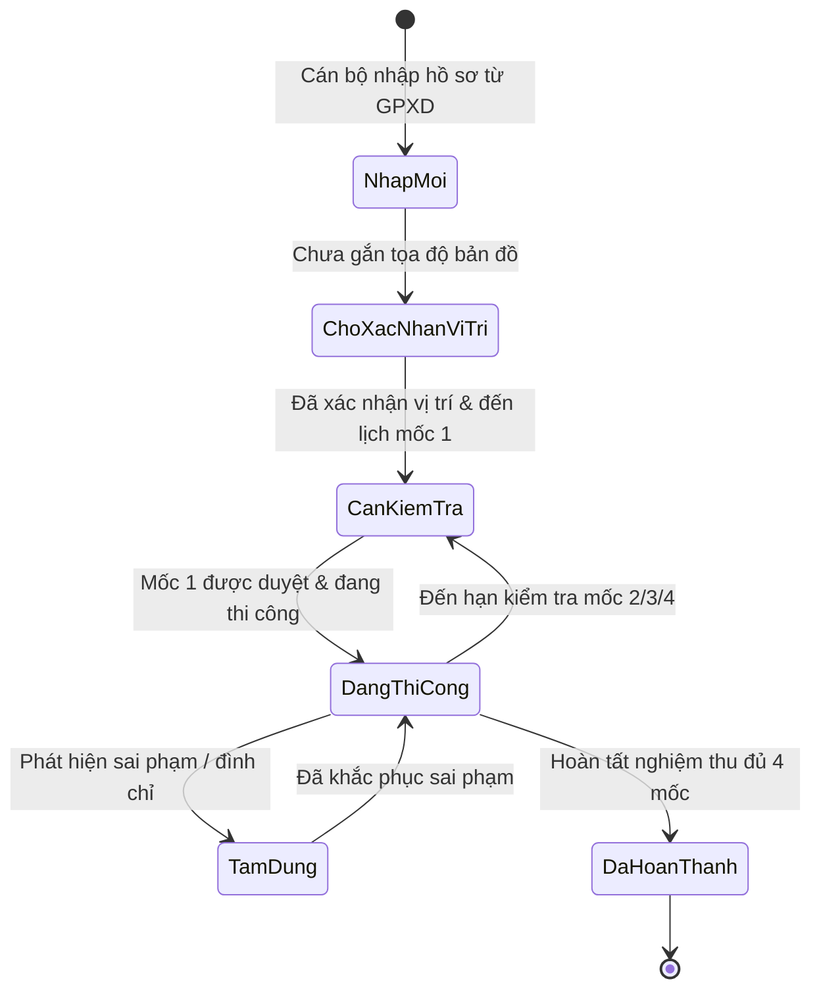
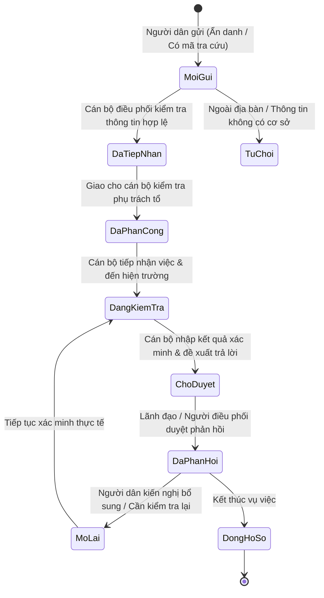
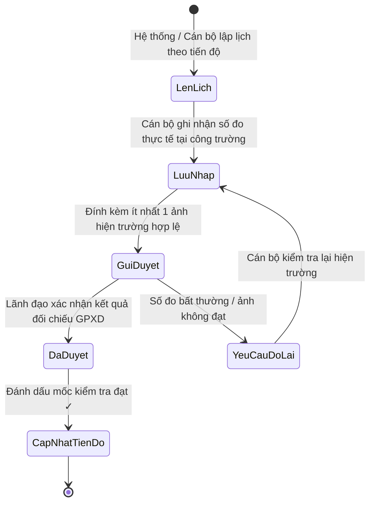

# SƠ ĐỒ CHUYỂN TRẠNG THÁI NGHIỆP VỤ (STATE MACHINES)
## Hệ thống QLTTXD Phường Thảo Nguyên

### 1. Vòng đời Hồ sơ Công trình & Giấy phép (`Permit Lifecycle`)

- **Quy tắc**:
  - Không thể tự động chuyển sang "Đã hoàn thành" khi chưa kiểm tra và duyệt đủ 4 mốc (hoặc có biên bản nghiệm thu hợp lệ).
  - Khi điều chỉnh GPXD: Giữ nguyên bản ghi cũ trong bảng lịch sử, tăng `version_id`, ghi nhận lý do và người cập nhật.

---

### 2. Quy trình Xử lý Phản ánh của Người dân (`Complaint Lifecycle`)

- **Quy tắc**:
  - Tại bước "Chờ duyệt", người duyệt phải tích chọn xác nhận đã đọc nội dung trước khi bấm "Duyệt phản hồi".
  - Người dân tra cứu bằng mã bí mật chỉ đọc được trạng thái và kết quả sau khi đã được duyệt ("Đã phản hồi").

---

### 3. Quy trình Kiểm tra Hiện trường 4 Mốc (`Inspection Lifecycle`)

- **Quy tắc**:
  - Nếu chỉ tiêu chưa đo: Lưu rõ "chưa đo / chưa xác định", tuyệt đối không mặc định là 0.
  - Ảnh tải lên phải được kiểm tra tính hợp lệ về định dạng và mã băm SHA-256.
